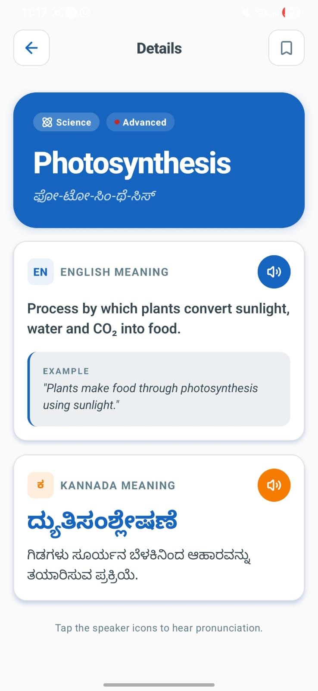
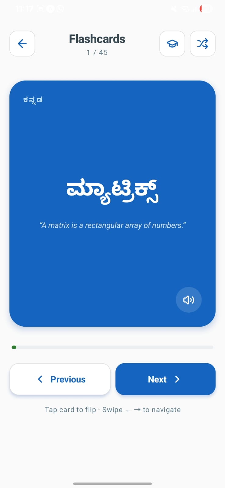
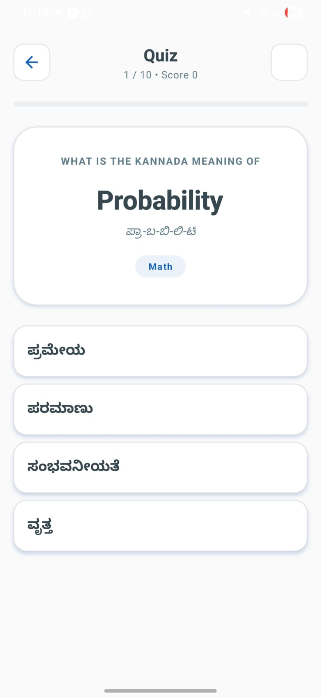
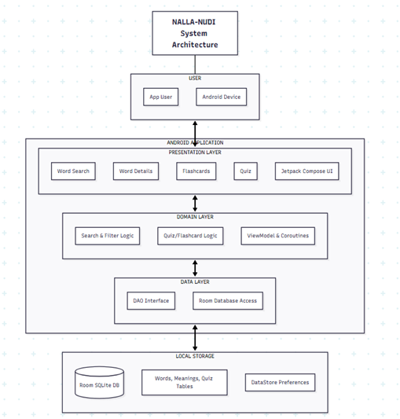

# Nalla-Nudi (ನಲ್ಲ-ನುಡಿ) 

Nalla-Nudi is a native, offline-first Android application engineered to bridge the linguistic gap for STEM (Science, Technology, Engineering, and Mathematics) students. By translating complex, professional technical terms from English into structured Kannada, the platform ensures that language limitations do not act as a barrier to qualitative technical education and professional growth.

---

## 📱 User Interface & Features

| Home Screen | Word Details |
| :---: | :---: |
|  |  |

| Flashcards Module | Interactive Quiz |
| :---: | :---: |
|  |  |

### **Key Core Modules:**
* **Word of the Day & Domain Filters:** Features curated technical entries categorized by domain spaces (Science, Math, Commerce, Computer Science) directly on the landing dashboard.
* **Bilingual Detail Breakdown:** Displays crisp English definitions alongside structured Kannada semantic translations, integrated with phonetic guides.
* **Text-to-Speech (TTS) Integration:** Provides standalone audio voice icons allowing students to hear high-fidelity vocal pronunciations for both English and Kannada terms.
* **Active Learning Engine:** Features high-retention Flashcards for rapid active recall and randomized interactive Quizzes with real-time evaluation matrices.

---

## 🏗️ System Architecture

The application is structured following the software design industry standards of **MVVM (Model-View-ViewModel)** and **Clean Architecture** patterns, guaranteeing a decoupling of core enterprise logic from the UI view elements.

<p align="center">
  
</p>

### **Architecture Data Flow:**
1.  **Presentation Layer:** Powered by **Jetpack Compose**, displaying reactive states emitted from UI view models.
2.  **Domain Layer:** Holds pure, framework-independent business entities, search logic components, and coroutine managers.
3.  **Data Layer:** Governs data distribution, containing DAO endpoints and implementing the repository structure pattern.
4.  **Local Storage:** Houses the physical SQLite local engine structured via the Room persistence wrapper alongside DataStore configuration rules.

---

## 🛠️ Built With & Libraries Used

* **Kotlin** - Primary programming language for modern, type-safe code implementation.
* **Jetpack Compose** - State-driven, declarative framework utilized to build the responsive user interface.
* **Room Database** - Robust SQLite abstraction framework enabling reliable, high-speed offline data reads.
* **Kotlin Coroutines & Flow** - Asynchronous streaming architecture running database queries off the UI thread.
* **Hilt (Dependency Injection)** - Automated compile-time DI engine managing component scopes and lifecycles.
* **Material Design 3** - Applied library configuration controlling dynamic theming paths and accessible styles.
* **Coil** - Asynchronous asset/image rendering layer running smart lifecycle-aware memory caching routines.
* **Google Gemini 1.5 Flash API** - Advanced cloud engine backing dynamic language queries and text parsing logic.
* **R8 / ProGuard Optimization** - Code shrinking, unused asset purging, and logic obfuscation framework for app hardening.

---

## 📁 Project Structure

The project layout clearly isolates the cross-platform infrastructure components, testing definitions, and documentation resources:

```text
├── .gradle/               # Local Gradle build cache and environment configurations
├── assets/                # Raw translation dictionary sets and static core properties
├── backend/               # Source implementation data layers, schemas, and API utilities
├── frontend/              # View layer screens, dynamic theme configs, and composables
├── kotlin_reference/      # Core technical reference manuals and code documentation files
├── screenshot/            # UI screenshots and system design architecture diagrams
├── tests/                 # Integrated instrumentation and local domain JUnit unit tests
├── design_guidelines.json # Centralized architectural layout constraints and rules
├── gitignore.txt          # Target properties defining files to be ignored by Git
├── README.md              # Main landing documentation overview
└── test_result.md         # Final testing verification reports and coverage summaries
